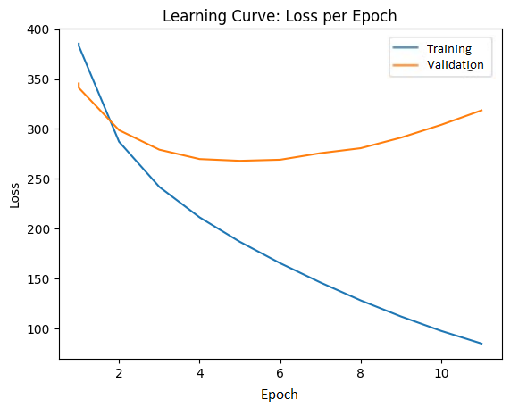
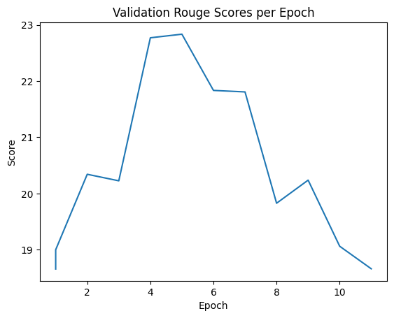

# Text-Summarizer

## Introduction
We will be creating a Natural Language Processing Transformer Model that performs Abstractive Text Summarization. Given a document, article, or body of text, the model will return a concise summary of the provided text. Since we are dealing with sequential data, we will be using a transformer provided by Pytorch, with a bidirectional encoder and an autoregressive decoder, and fine-tuning it to enhance performance as required for the task. 

## Model
As we are creating a text summarizer model, our model architecture is the same as the one described in the paper “Attention is all you need” Ashish Vaswani et al. 

We start by tokenizing our data. This is decribed in detail in the data transformation section below.

After the data has been tokenized, its vector representation, an embedding, is generated. In this project, we are using a pre-trained embedding, which essentially looks up the respective embedding for the token given to it.

Unlike a recurrent neural network, the transformer architecture does not have a notion of sequential order built into it. Therefore, to give the transformer some information about the position of each token, positional encodings are calculated separately. The function used to find positional encoding is the same function used in the paper mentioned above. Specifically, the encoding contains sine and cosine functions of different frequencies, which enable the model to differentiate between tokens at different positions.

Before our encoder architecture, the word embeddings and positional encodings are added together element-wise to create a combined input representation. This combined representation is then passed through several layers in the encoder layer. 

The first sub-layer in each encoder unit is a multi-head self-attention mechanism. It receives the combined input representation and calculates a new set of embeddings that have attended to all positions in the sequence, effectively creating a representation of the entire sequence.

After this layer there is a “Add & Norm” or residual layer that adds the input embeddings to the output embeddings of the previous layer and normalizes it. This helps to mitigate the vanishing gradient problem, allows gradients to flow more easily through the network during training, and improves the generalization performance of the network. 

Then the outputs are passed through a fully connected layer which allows each position to interact with the other positions through a non-linear function to increase the expressiveness of the encoder.

Finally, the outputs from the previous layer are passed through another residual layer for the same reason described earlier. 
 
This forms one unit of the encoder layer. We will be using multiple layers in our model that are stacked together so that the model can capture complex relationships between input tokens allowing it to learn more complicated patterns and relationships in the data.

In the decoder layer, we similarly encode the outputs by creating the word embeddings and positional encodings and adding them together element-wise which is passed through a multi-head attention and residual layer exactly as before for the same reasons. 

Then these hidden output states and the outputs from the encoder layer are passed through another multi-head attention layer. The purpose of this mechanism is to compute a weighted sum of the encoder output, where the weights are computed based on the similarity between the decoder's current hidden state and each encoder output vector. 

Finally, the output of this layer is passed through a residual layer, a fully connected layer, and another residual layer for the same reasons as discussed earlier. 

The decoder unit is then stacked as well. Each unit can learn to focus on different aspects of the input and output sequences, and the final layer can combine all of this information to generate the final output sequence. The model can learn to attend to different parts of the input and output sequences at different levels of abstraction.


### Model Figure

### Model Parameters
The model has 2 encoder and decoder layers. Each encoder contains 4 Multi-attention Heads, 1 feed-forward network, and 2 Layer normalization layers. Each of these have a certainnumber of parameters.

The shapes of $W_{Q}$, $W_{K}$, and $W_{V}$ are given by (dmodel, $\frac{dmodel}{nheads}$), where dmodel is the embedding size and nheads is the number of attention heads. Using an embedding size of 256, and 4 attention heads, the dimensions of $W_{Q}$, $W_{K}$, $W_{V}$ are $256 \times 64$ each. Each weight matrix also has a bias term which has a shape of $64 \times 1$. Additionally, the final weight matrix that is applied after concatenation, $W_{O}$ has a shape of dmodel x dmodel, which results in a shape of $256 \times 256$. $W_{O}$ also has a bias term with shape $256 \times 1$. The number of parameters of all 4 attention head is given by: Parameters(Multi-attention Heads) = $(256 \times 256 + 256) + (64 \times 256 + 64) \times 3 \times 4 = 263168$.

Next we have layer normalization parameters. Each layer norm has 2 learnable parameters per embedding dimension. Thus the number of parameters is given by: Parameters(LayerNorm) = $2 \times 256 = 512$

There is also a feed-forward component. The feed-forwad network has 2 layers, one with 2048 hidden units and the other with 256 hidden units. Thus,  $W_{1}$ has shape $256 \times 2048$, $W_{2}$ has shape $2048 \times 256$. The bias terms, $b_{1}$, $b_{2}$ have shapes 2048 x 1 and $256 \times 1$, respectively. Hence, the total parameters in the feed-forward network is given by: Parameters(Feed-Forward) = $(256 \times 2048 + 2048) + (2048 \times 256 + 256) = 1050880$

Each encoder consists of 1 Multi-Attention Head (with 4 attention heads), 2 Layer Normalization layers, and 1 Feed-Forward Network. Therefore, the total number of parameters in both encoders combined is given by: Parameters(Encoders) = $(263168 + (2 \times 512) + 1050880) \times 2 = 2630144$

Each decoder consists of 2 Multi-Attention Head (with 4 attention heads), 3 Layer Normalization layers, and 1 Feed-Forward Network. Therefore, the total number of parameters in both encoders combined is given by: Parameters(Encoders) = $((2 \times 263168) + 3( \times 512) + 1050880) \times 2 = 3157504$

The total number of parameters in the model is: Parameters(TransformerModel) = $2630144 + 3157504 = 5787648$.

### Model Examples

**The following is an example of a successful abstractive summarization performed by the model, with a Rouge score of: 0.999999995.**

>**Input:** jakarta share prices closed #. # percent lower tuesday amid selling pressure on heavyweight stocks, brokers said.
>
>**Target:** jakarta shares close #. # percent lower
>
>**Model Output:** jakarta shares close #. # percent lower


**The following is an example of an unsuccesful summarization performed by the model, with a Rouge score of: 0.08695651674858251.**

>**Input:**  federal regulators, moving to reduce the fees local baby bell companies charge to connect long - distance calls, said today they may let the industry bring the charges down gradually without imposing a government timetable.
>
>**Target:**  u. s. fcc moves to gradually cut long distance access charges
>
>**Model Output:**  federal reserve says boss has no plans for a decade


## Data
### Data Sources
Our dataset is a subset of the "Gigaword" dataset, acquired from the Hugging Face Dataset library. Gigaword is the largest dataset available to be used for the summarization task, with 3.8 million training samples, 189k validation samples and 1951 test samples. 

### Data Split
As per our initial idea, we planned to combine and use 3 complete datasets from the Hugging Face dataset library, "Gigaword", "Multi_news", and "CNN_dailymail",  but due to the lack of computational resources, we quickly realized that is not viable and we have to subset the data. We decided to use a subset of the Gigaword Dataset, as it is the largest of the 3, to ensure variability of characteristics and context in our data to help the model generalize and learn appropriately.


**Gigaword:**
Train: 3803957 (95%), Validation: 189651(4.75%), Test: 1951(0.25%)

**Subset Dataset:**
Train: 76079 (91%), Validation: 5690 (6%), Test: 1951(3%)

We believe this subset accurately represents the dataset and has a sufficient number of samples for the model to be trained and perform well. 

### Data Summary
To accurately interpret our results, we collected summary statistics on our dataset. 

#### Training Data
There are 76079 training samples in our dataset. 
The average document length is: 31.42806819227382 words, and the average summary length is:   8.206430158125107. There are 42986 unique words, and a total of 2391016 words, in the documents and 25275 unique words, and a total of 624337 words in the summary of the training set. The most commonly used words and their frequencies are as follows:


| Word (Document) | Frequency (%) | Word (Summary)     | Frequency (%) |
| --------------- | ------------- | ------------------ | ------------- |
| the             | 4.87          | in                 | 3.29          |
| .               | 3.18          | to                 | 3.27          |
| ,               | 3.07          | of                 | 1.62          |
| a               | 2.75          | for                | 1.59          |
| of              | 2.56          | on                 | 1.32          |
| in              | 2.39          | 's                 | 1.30          |
| to              | 2.35          | us                 | 0.97          |
| on              | 1.60          | unk                | 0.61          |
| said            | 1.37          | percent            | 0.60          |
| and             | 1.29          | as                 | 0.58          |


#### Validation Data
There are 5690 validation samples in our dataset. 
The average document length is: 31.138137082601055 words, and the average summary length is: 7.9195079086116 words, in the validation set. There are 14086 unique words, and a total of 177176 words in the documents, and 7873 unique words, and a total of 45062 words in the summary of the validation set. The most commonly used words in the validation set and their frequencies are as follows:

| Word (Document) | Frequency (%) | Word (Summary)     | Frequency (%) |
| --------------- | ------------- | ------------------ | ------------- |
| the             | 4.83          | to                 | 3.35          |
| .               | 3.21          | in                 | 2.98          |
| ,               | 3.05          | for                | 1.78          |
| a               | 2.65          | of                 | 1.49          |
| of              | 2.49          | 's                 | 1.44          |
| to              | 2.44          | on                 | 1.18          |
| in              | 2.25          | us                 | 1.07          |
| on              | 1.68          | unk                | 0.84          |
| 's              | 1.36          | over               | 0.59          |
| said            | 1.32          | ##                 | 0.53          |

#### Test Data
There are 1951 validation samples in our dataset. 
The average document length is: 29.69656586365966 words, and the average summary length is: 8.791901588925754 words, in the test set. There are 9445 unique words, and a total of 57938 words in the documents, and 5096 unique words, and a total of 17153 words in the summary of the test set. The most commonly used words in the test set and their frequencies are as follows:

| Word (Document) | Frequency (%) | Word (Summary)     | Frequency (%) |
| --------------- | ------------- | ------------------ | ------------- |
| the             | 4.96          | unk                | 4.89          |
| ,               | 3.52          | to                 | 2.83          |
| .               | 3.21          | in                 | 2.81          |
| a               | 2.63          | :                  | 2.10          |
| of              | 2.54          | of                 | 1.61          |
| to              | 2.30          | for                | 1.31          |
| in              | 2.23          | 's                 | 1.07          |
| and             | 1.61          | on                 | 0.99          |
| on              | 1.37          | by                 | 0.89          |
| 's              | 1.18          | with               | 0.73          |


### Data Transformation
Since our data is Text. To prepare our data for input to the model, we used the pretrained BertTokenizer ('bert-base-uncased') to convert the text into a sequence of tokens. The [CLS] and [SEP] tokens were added to the start and end of each sequence, and the sequences were padded using a fixed size padding. The tokens were further converted into a numeric representation where each word was mapped to its corresponding index in the vocabulary. This was followed by an embedding layer that has a size of (30522, 256) where 30522 is the size of the vocabulary and 256 is the embedding size. This was done to create numerical representation of the tokens and assemble them into tensors.

```python

from transformers import BertTokenizer
tokenizer = BertTokenizer.from_pretrained('bert-base-uncased')

def preprocess_function(examples):
    model_inputs = tokenizer(examples['document'], padding='max_length', \
                             max_length=75, add_special_tokens=True)
    labels = tokenizer(text_target=examples["summary"], padding='max_length', \
                       max_length=70, add_special_tokens=True)
    model_inputs["labels"] = labels["input_ids"]
    model_inputs["labels_mask"] = labels["attention_mask"]
    return model_inputs
    
```

The tokenization and embedding of an example sentence:

```python
example = {'document': "a powerful rally tuesday helped wall street recoup some losses from monday 's rout , 
            amid renewed hope for us passage of a financial rescue package .",
            'summary': 'big rally helps wall street recoup part of record plunge'}
ex_token = preprocess_function(example)

# convert tokens to their vocabulary index representation (101 is the [CLS] token and 102 is the [SEP] token).
print(ex_token['input_ids']) # [101, 1037, 3928, 8320, 9857, 3271, 2813, 2395, 28667, 7140, 2361, 2070, 6409, 2013, 6928, 1005, 1055, 20996, 4904, 1010, 13463, 9100,   3246, 2005, 2149, 6019, 1997, 1037, 3361, 5343, 7427, 1012, 102]
print(ex_token['labels']) #[101, 2502, 8320, 7126, 2813, 2395, 28667, 7140, 2361, 2112, 1997, 2501, 25912, 102]


example_emb = nn.Embedding(30522, 256)
inp_emb = example_emb(torch.tensor(ex_token['input_ids']))
print(inp_emb) # tensor([[ 0.9791,  0.8341,  0.0265,  ...,  0.1341,  0.3989,  2.0854],
                        #[-0.1030,  2.0953, -1.2685,  ..., -1.3507,  1.0663, -0.5291],
                        #[ 2.4593, -0.0891, -0.9599,  ..., -0.4411,  1.6811, -0.5325],
                        #...,
                        #[ 0.2698, -1.0205,  0.5904,  ...,  0.5692, -0.6299,  0.2383],
                        #[ 0.2698, -1.0205,  0.5904,  ...,  0.5692, -0.6299,  0.2383],
                        #[ 0.2698, -1.0205,  0.5904,  ...,  0.5692, -0.6299,  0.2383]])

```


## Training
### Training Curve

The training curves of the model are:







### Hyperparameter Tuning

The hyperparameters that we tuned in the model are batch size, learning rate, number of heads in the multiheadattention models, the number of sub-encoder-layers in the encoder, and the number of sub-decoder-layers in the decoder. 

We began training our model with a batch size of 32, and various values for the other hyperparameters. Although our model converged, it resulted in a high validation loss and an overall poor performance. We trained a few more models with the same batch size and saw no improvement. Increasing the batch size to 64, did take slightly longer to converge, but we saw a significant improvement in our model's performance. Increasing our batch size beyond 64 led the model to take an extremely long time to converge, with little to no improvement. Hence, we chose to set the batch size to 64. 

For the learning rate, initially we started with 0.000001. But as we trained the model, convergence was taking an extended period of time where our model weights were not being updated effectively. As we began to increase the learning rate, we saw better performance in our models, resulting in a smaller validation loss and a higher rouge score. But as the learning rate got too big, the validation loss began to diverge and produce a volatile loss curve. After testing several values for the learning rate, we found that a learning rate of 0.00025 resulted in the best overall performance. 

For our transformer model, due to the lack of computational resources, a model with a larger architecture was not possible. We trained a model with 16 heads and 8 sub-encoder-layers and 8 sub-decoder-layers, as well as another model with 8 heads and 4 sub-encoder-layers and 4 sub-decoder-layers. These larger models were taking a long time to train and were showing signs of overfitting to the training data with a high validation loss and a low rouge score. We found the best performing model to be with 4 heads and 2 sub-encoder and 2 sub-decoder layers, as it able to generalize better on the data and did not overfit. 

Using checkpointing, we found it best to train the model for 11 epochs, as after the 11 epochs the validation loss began to further diverge from the minima. The minimum of the validation loss occured in the 5th epoch, as can be seen in the Loss curve and the Rouge score curve. 


### Quantitative Measures

For our purposes, computing accuracy did not seem reasonable since a generated summary may not be exactly the same as the target sumamry, but can still effectively summarize the given text. Thus, we used ROUGE (Recall-Oriented Understudy for Gisting Evaluation) scores to evaluate quality of the generated summary. ROUGE is typically used for summarization tasks as it measures the overlap between generated summary and target summary. For this task we used Rouge-1 scores, which measures the overlap of unigrams (individual words) between the generated summary and the target summary. Moreover, we used the f1 score from Rouge-1 which the harmonic mean between precision and recall. In this context, precision is the ratio between the number of overlapping words between the generated summary and the target summary and total number of words in the generated summary. It measures how concise the generated summary is. Recall is the ratio between the number of overlapping words between the generated summary and the target summary and total number of words in the target summary. It measures how accurate the generated summary is. The f1 score combines both of these measures into one value by and measures how concise and accurate a summary is. Hence, the Rouge-1 f1 score is an appropriate quatitative measure for this task.

## Results
Evaluating from a qualitative perspective, the model was able to generate coherent and grammatically correct outputs given the input text. However, sometimes the outputs were completely irrelevent to the input text and other times they were an exact match to the target sequence.

Evaluating from a quantitative perspective, the model achieved an average Rouge-1 f1 score of approximately 0.30. The Rouge-1 f1 score measures how accurate and concise the generated summary is by comparing with the target summary. The average score of 0.30 appears very low as there were a few outliers with scores of less than 0.06 which dragged the average down. About 20% of test examples achieved a score between 0.35-0.5, while 10% achieved a score of above 0.5. The generated examples with scores between 0.35-0.5 captured a high level overview of the input text and would miss the details. The examples with scores of greater than 0.5 captured most of the details as well. Examples with scores below 0.35 were mostly irrelevant to the input text but grammatically correct.

### Justification
Our model performed reasonably well given the difficulty of this task and the resource constraints. The model was able to generate coherent and relevant outputs for a significant amount of examples in the test set and exact summaries for some. For some examples, it generated coherent but unrelated summaries and in extreme cases generated very poor outputs that were neither related nor coherent.

 However, this was expected given the time and resource constraints. Due to the resource constraints (memory and GPU) we were unable to use a larger dataset or have training examples that had longer sequences. Longer sequences required a significantly larger amount of GPU memory and training time. To combat the GPU memory constraint, we implemented gradient accumalation. The goal was to accumalate gradients over a few small batches and update parameters after the set amount of batches. However, this further slowed down the training to a point that it was unfeasable to continue with the training, as Google Colab would terminate the session after a few hours. Using longer sequences and sequences of varying lengths would have greatly improved the model's performance as it would have been able to learn different structures and would have been able to generalize better. A larger dataset of small sequences would have also helped the model's performance, however this also increased the training time tremendously. Thus, we had to opt for a smaller dataset (approximately 76,000 training examples) of smaller sequences (at most 75 words). 

The smaller dataset presented another challenge that it was much more prone to the risk of overfitting. After trying many models and hyperparameters, we found that after a few epochs, the training loss would decrease rapidly while the validation loss would steadily increase, indicating that the model began to overfit. To combat this we decreased the complexity of the model considerably, which improved the model's performance significantly. However, we realized that given the size of the dataset and the difficulty of the task, there is a very fine line between overfitting and underfitting. We found that decreasing the model complexity slightly (decreasing number of encoders/decoders by one) would cause underfitting, while keeping it the same would cause overfitting after a certain number of epochs. We hypothesized that this may be due to the size of the dataset and the length of the sequences, where a slightly more complex model is too complex for the data and a slightly simpler model could not capture important features in the data.Lastly, this can also be due to erraneous examples in the dataset, where the target sequence was completely irrelevant tot he input text. One of these examples is presented below:

Input text: it was supposed to be a cozy affair. \\
Target summary: out in force : as # beloved sci - fi franchises fade away fans have seized the spotlight like never before.

It can be seen that the target summary is completely irrelevant to the input text. Although these examples make up a small percentage of the dataset, they can still be detrimental to the learning of the model. These examples can inflate the loss and cause the model to learn incorrect representations. Also, attempting to fit to these examples would cause poor performance on the validation and test sets as these examples do not generalize well. Detecting and getting rid of these examples is extremely challenging as we would have to manually check more than 78,000 training examples and remove them from the dataset. A viable solution besides changing datasets is to increase the batch size so that the loss of these examples account only for a small portion of the total batch loss which is used for parameter updates. However, the impact may still not be completely discounted.

Overall, given the size of the dataset and sequences and the difficulty of the task, the model's performance was reasonable. 
## Ethical Considerations
For a text summarizing model, while its summarization helps to decrease the workload
doing repetitive reading tasks, the same functionality can have many implications
towards misuse. An obvious one is plagiarism; relevant office and school tasks can be
done using the model.

Another issue in our model is that it can have biased output. For example, in the case of
our data set, comprised of news articles and their respective summaries, 
our model may just pick up facts or arguments that support a certain political wing and produce
output with that context. 

Machine learning models also cannot judge morality themselves. They have to be
trained for specific issues individually(which tend to be a lot) and as we won’t be using
any of those datasets, our model could potentially summarize all sorts of text, which
could in turn potentially be generated by a group of people targeting another group of
people.

## Authors
